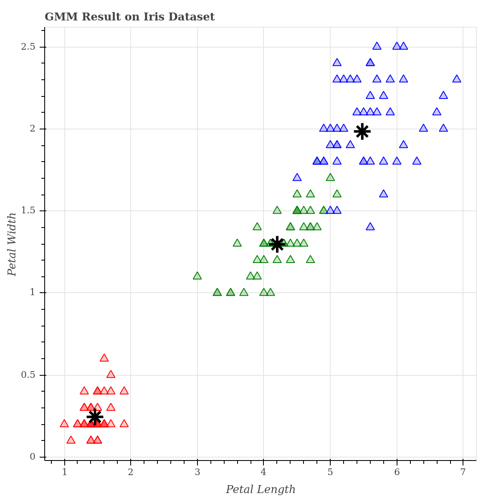

# Gaussian Mixture Models

This is a python implementation of the Gaussian Mixture Models,
which is an unsupervised machine learning algorithm that is used for clustering.

## Requirements 
[](https://www.python.org/downloads/release/python-360/)

## Usage 
In the following example, I have applied GMM to the Iris dataset and visualized the final result.

### Code
``` python
from GaussianMixtureModels.GMM import GMM
from sklearn import datasets
from bokeh.plotting import figure, show

if __name__ == '__main__':

    # Load the data
    # ---------------------
    iris = datasets.load_iris()
    X = iris.data
    y = iris.target

    # Apply GMM
    # ---------------------
    gmm = GMM(n_neighbors=5, max_iters=100, init_kmeans=False, tol=1e-6)
    gmm.fit(X)
    mu = gmm.mu
    sigma = gmm.sigma
    n_gaussians = mu.shape[0]

    # Visualization
    # ---------------------
    colormap = {0: 'red', 1: 'green', 2: 'blue'}
    colors = [colormap[x] for x in y]

    p = figure(title="GMM Result on Iris Dataset")
    p.scatter(X[:, 2], X[:, 3], marker='triangle', size=10, color=colors, fill_alpha=0.2)
    for i in range(n_gaussians):
        p.scatter(mu[i, 2], mu[i, 3], marker='asterisk', line_color='black', size=20, line_width=3)
    p.xaxis.axis_label = 'Petal Length'
    p.yaxis.axis_label = 'Petal Width'
    show(p)
```

### Final Result

<center>
  <table>
    <tr>
      <td></td>
    </tr>
    <tr>
      <td align="center"><em>Gaussian Mixture Models Result</em></td>
    </tr>
  </table>
</center>


## License
[](https://opensource.org/licenses/MIT)
