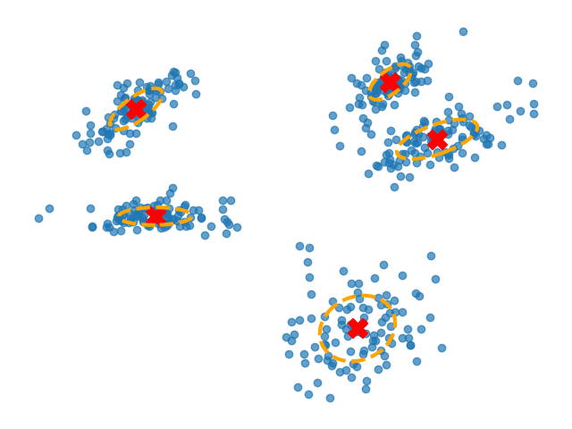

# Gaussian Mixture Models

This is a python implementation of the Gaussian Mixture Models,
which is an unsupervised machine learning algorithm that is used for clustering.

## Requirements 
[](https://www.python.org/downloads/release/python-360/)

## Usage 
``` python
from GaussianMixtureModels.GMM import GMM

gmm = GMM(n_neighbors=5, max_iters=100, init_kmeans=False, tol=1e-6)
gmm.fit(X)
```

## Examples
The code is tested on Fishbowl and Swissroll data and the results are as follows:

<div>
  <table>
    <tr>
      <td></td>
    </tr>
    <tr>
      <td align="center"><em>Gaussian Mixture Models Result</em></td>
    </tr>
  </table>
</div>