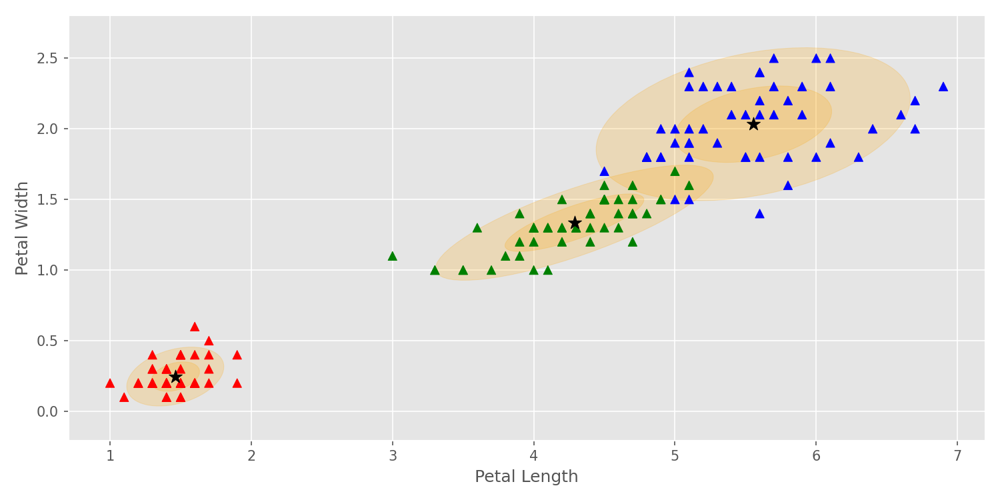

# Gaussian Mixture Models

This is a python implementation of the Gaussian Mixture Models,
which is an unsupervised machine learning algorithm that is used for clustering.

## Requirements 
[](https://www.python.org/downloads/release/python-360/)

**Other Reguirements**
    - numpy==1.18
    - matplotlib==3.2

## Usage 
In the following example, I have applied GMM to the Iris dataset and visualized the final result.

### Code
``` python
from GaussianMixtureModels.GMM import GMM
from sklearn import datasets
from GaussianMixtureModels.utils import plot_gmm

if __name__ == '__main__':

    # Load the data
    # ---------------------
    iris = datasets.load_iris()
    X = iris.data
    y = iris.target

    # Apply GMM
    # ---------------------
    X = np.stack([X[:, 2], X[:, 3]]).T
    gmm = GMM(n_components=3, max_iters=100, init_kmeans=False, tol=1e-6)
    gmm.fit(X)

    # Visualization
    # ---------------------
    colormap = {0: 'red', 1: 'green', 2: 'blue'}
    colors = [colormap[x] for x in y]

    xy_labels = ['Petal Length', 'Petal Width']
    plot_gmm(gmm, X, colors, xy_labels=xy_labels)
```

### Final Result

<center>
  <table>
    <tr>
      <td></td>
    </tr>
    <tr>
      <td align="center"><em>Gaussian Mixture Models Result</em></td>
    </tr>
  </table>
</center>


## License
[](https://opensource.org/licenses/MIT)
