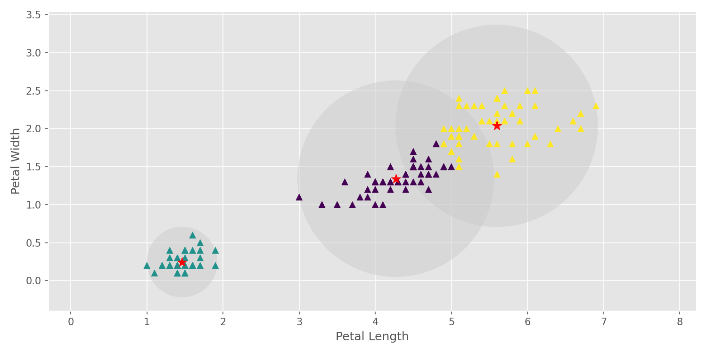

# K-Means Clustering

This is a python implementation of the K-Means Clustering,
which is an unsupervised machine learning algorithm that is used for clustering.

## Requirements 
[](https://www.python.org/downloads/release/python-360/)

**Other Reguirements**
- numpy==1.18.4
- matplotlib==3.2.1
- scipy==1.4.1

## Usage 
In the following example, I have applied KMeans to the Iris dataset and visualized the final result.

### Code
``` python
from KMeansClustering.KMeans import KMeans
from KMeansClustering.utils import plot_kmeans
from sklearn import datasets

if __name__ == '__main__':

    # Load the data
    # ---------------------
    iris = datasets.load_iris()
    X = iris.data
    y = iris.target

    # Apply GMM
    # ---------------------
    X = np.stack([X[:, 2], X[:, 3]]).T
    kmeans = KMeans(n_components=3, max_iter=100)
    kmeans.fit(X)

    # Visualization
    # ---------------------
    xy_labels = ['Petal Length', 'Petal Width']
    plot_kmeans(kmeans, X, xy_labels)
```

### Final Result

<center>
  <table>
    <tr>
      <td></td>
    </tr>
    <tr>
      <td align="center"><em>Gaussian Mixture Models Result</em></td>
    </tr>
  </table>
</center>


## License
[](https://opensource.org/licenses/MIT)
