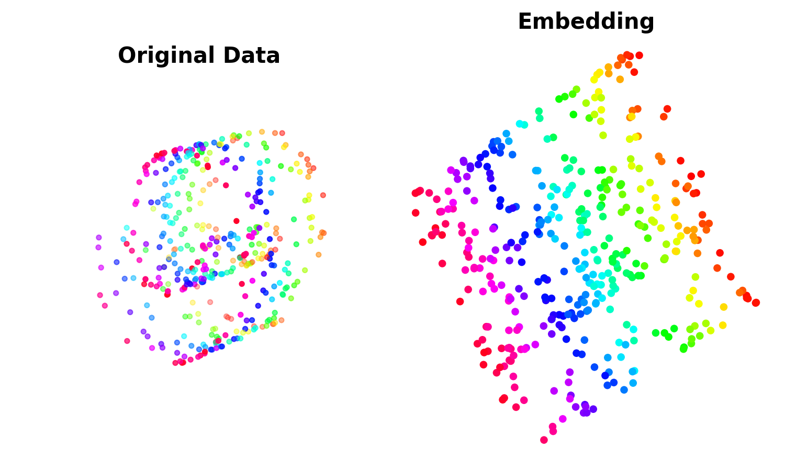
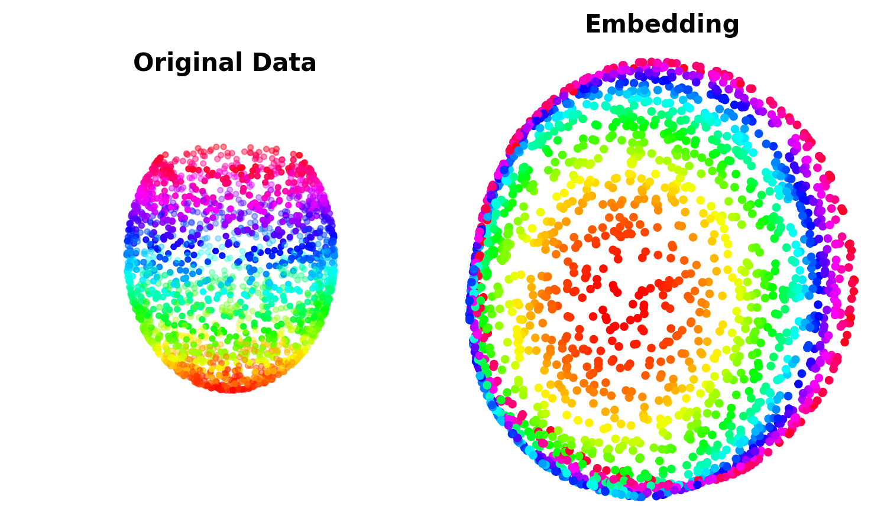

# Locally Linear Embedding
This is a python implementation of the [Locally Linear Embedding](https://cs.nyu.edu/~roweis/lle/algorithm.html) algorithm,
which is an unsupervised machine learning algorithm for dimensionality reduction.

## Requirements 
The code is tested with:
  * Python 3.6

## Usage 
``` python
from LocallyLinearEmbedding.LLE import LLE

lle = LLE(n_components=2, tol=1e-3, neighbors_algorithm='KNN', n_neighbors=30)           
embedding = lle.fit_transform(X)
```

## Examples
The code is tested on Fishbowl and Swissroll data and the results are as follows:

 
