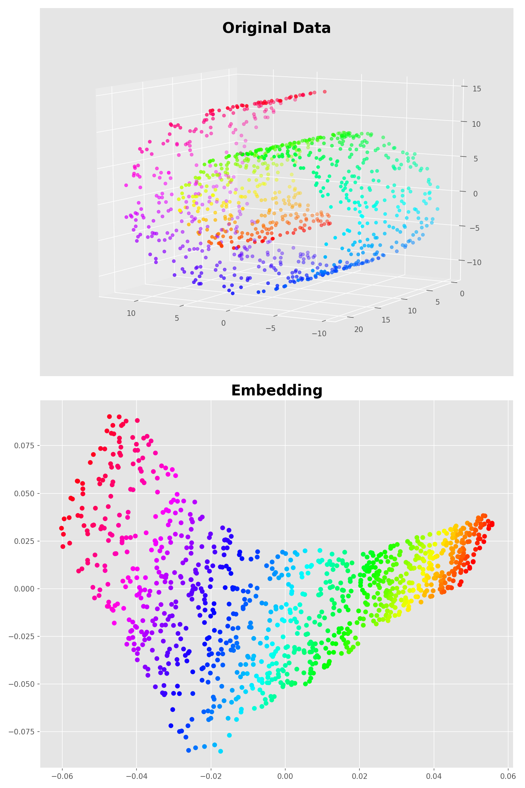

# Locally Linear Embedding
This is a python implementation of the [Locally Linear Embedding](https://cs.nyu.edu/~roweis/lle/algorithm.html) algorithm,
which is an unsupervised machine learning algorithm for dimensionality reduction.

## Requirements 
[](https://www.python.org/downloads/release/python-360/)

## Usage 

In the following example, I have applied LLE to the Swiss-Roll data and visualized the final result.
**Code**
``` python
from LocallyLinearEmbedding.LLE import LLE
import numpy as np
from matplotlib.pylab import plt
from sklearn.datasets import make_swiss_roll

if __name__ == '__main__':
    
    # Create the Swiss Roll data
    # ---------------------------
    n_samples = 1000
    noise = 0.0
    X, y = make_swiss_roll(n_samples, noise=noise)

    # Apply LLE
    # ---------------------------
    lle = LLE(n_components=2,
              neighbors_algorithm='KNN',
              n_neighbors=13,
              epsilon=1e-3)
    Xp = lle.fit_transform(X)

    # Visualization
    # ---------------------------
    colors = 2 * np.pi * y
    plt.style.use('ggplot')
    fig = plt.figure(figsize=(10, 15), dpi=150)
    ax = fig.add_subplot(211, projection='3d')
    ax.view_init(elev=10., azim=120)
    ax.scatter(X[:, 0], X[:, 1], X[:, 2], c=colors, cmap='hsv')
    ax.set_title('Original Data', fontdict={'fontsize': 20, 'fontweight': 'bold'})
    ax = fig.add_subplot(212)
    ax.scatter(Xp[:, 0], Xp[:, 1], c=colors, cmap='hsv')
    ax.set_title('Embedding', fontdict={'fontsize': 20, 'fontweight': 'bold'})
    plt.show()
```

**Result**
<center>
<div>
  <table>
    <tr>
      <td></td>
    </tr>
    <tr>
      <td align="center"><em>LLE Result on the SwissRoll Data</em></td>
    </tr>
  </table>
</div>
</center>


## License
[](https://opensource.org/licenses/MIT)
