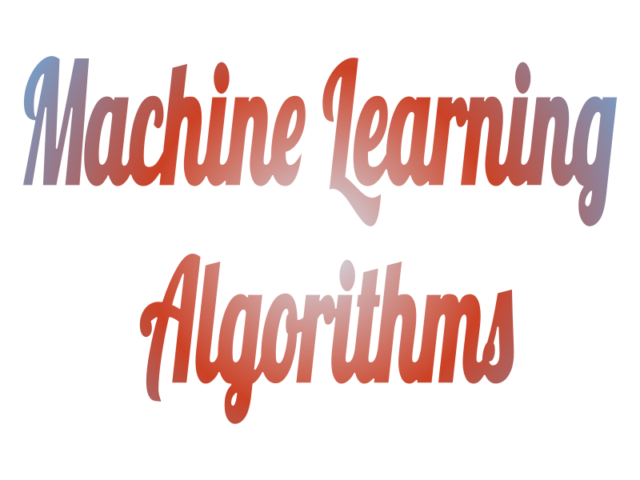

 

    
 

 
***
  
Python Implementation of Various Machine Learning Algorithms. 

If you find this code useful, please star the repository.

## Algorithms
  * Unsupervised Learning
    * [Locally Linear Embedding](LocallyLinearEmbedding/LLE.md)
    * [Gaussian Mixture Models](GaussianMixtureModels/GMM.md)
    * [K-Means Clustering](KMeansClustering/KMeans.md)
    * [Principal Component Analysis](PrincipalComponentAnalysis/PCA.py)
    * Agglomerative Clustering
   
   * Supervised Learning
     * Linear Regression
     * Kernel Ridge Regression
     * Support Vector Machines
     * Linear Discriminant Analysis

## Task List
- [x] Locally Linear Embedding
- [x] Gaussian Mixture Models
- [x] K-Means Clustering
- [X] Principal Component Analysis
- [ ] Linear Regression
- [ ] Kernel Ridge Regression
- [ ] Support Vector Machines
- [ ] Linear Discriminant Analysis
- [ ] Agglomerative Clustering

## License

